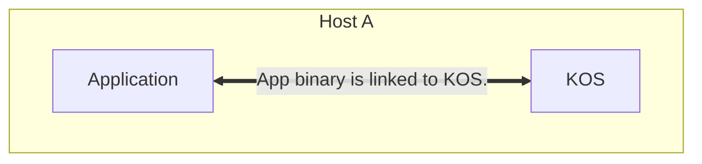
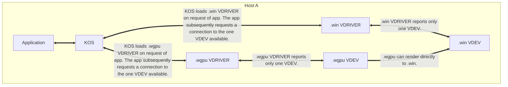
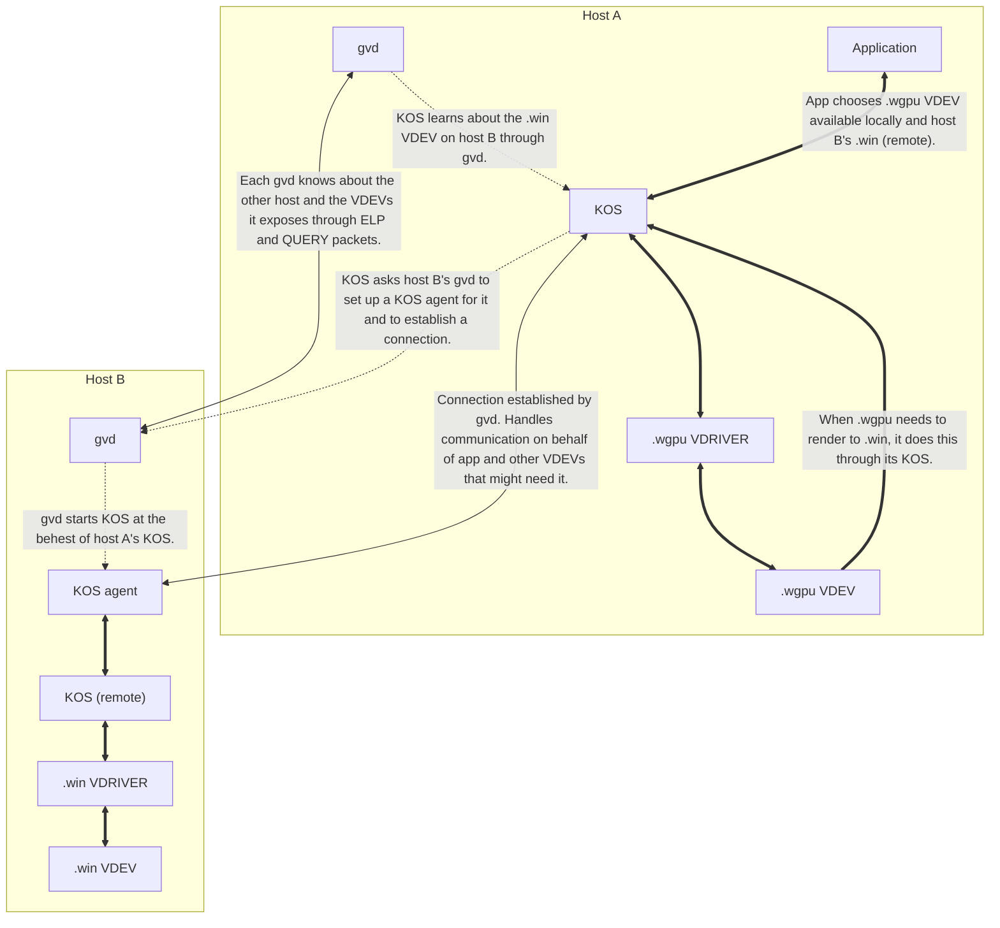
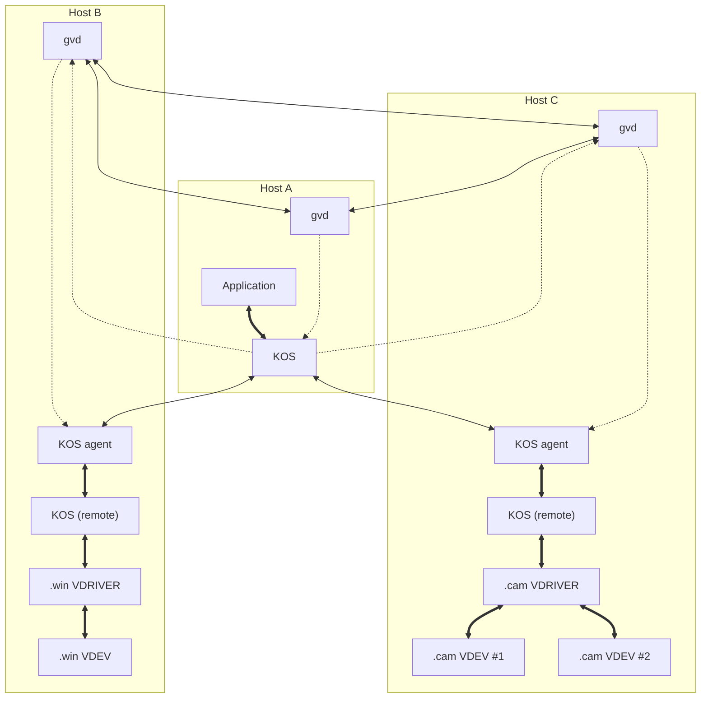
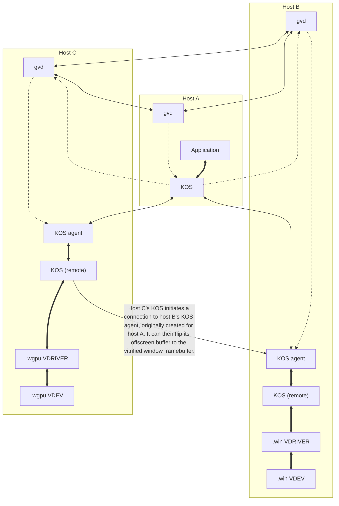

# AQUA Architecture

This document describes the various components of AQUA and how they interact with eachother through examples.

The current version of AQUA is 4.0.

## Overview

The 3 main components of AQUA are:

- *The KOS*: This is the actual runtime all AQUA applications are in some way linked to, and is all that the application actually interacts with. More information can be found [here](../kos/README.md).
- *VDRIVERs*: These are the platform-specific implementations of VDEV interfaces. One VDRIVER may expose more than one VDEV. For example, the `.cam` VDRIVER would expose one VDEV for each physical camera on the system. More information can be found [here](../vdev/README.md).
- *The GrapeVine daemon (gvd)*: This is a daemon that runs on each network-enabled AQUA host and is responsible for discovering other hosts and their exposed VDEVs, as well as initiating connections to them. More information can be found [here](../gv/README.md).

## Examples

Here are a few examples of application setups.

Some of these examples make use of multiple hosts, named A, B, and C.

Thick lines indicate components linked together, thin lines indicate connections such as through the network or IPC, and dotted lines indicate one-off communication, usually during initial setup.

Each example roughly builds upon the previous ones, so labeled arrows are not repeated after the first time they are used.

### No devices used

This is a pretty boring situation in which the application isn't able to do all that much.
It is, however, the simplest setup which can be called "AQUA".

### Rendering a triangle with WebGPU to a window (locally)

In this example, the application asks the KOS for both .wgpu (WebGPU) and .win (window) VDEVs.
The KOS then finds VDRIVERs supporting these interfaces, loads them and links them, and reports back to the application the two VDEVs found (each VDRIVER reports only one VDEV in this situation).

The application, through the KOS, initiates connections to the .wgpu and .win VDEVs, and creates a window with .win.
It received an opaque pointer to this window, which is an unreadable handle containing the host ID of the machine this pointer is on.

It then creates a WebGPU context with its .wgpu connection, and passes its window's opaque pointer to it.
The .wgpu VDRIVER can read the host ID of the window's opaque pointer and can see it is on the same machine, so it can directly and natively render to this window.

### Rendering a triangle with WebGPU to a remote window

This situation is a little trickier.

Before the app is run, the GrapeVine daemons on both hosts A and B are running and discover eachother.
They are aware of the VDEVs available on eachother at any given time.

When the application is started up and asks for the `.wgpu` and `.win` VDEVs, its KOS will let it know of the VDEVs locally available, but it will also ask gvd of all the VDEVs it knows about on remote hosts and expose them to the application.

In this situation the application can only choose the local `.wgpu` and remote `.win` VDEVs, but if there also was a `.win` VDEV locally, it could have chosen that one instead, and same thing if there was a `.wgpu` VDEV on host B.

Since the application chose host B's `.win` VDEV, the KOS will ask host B's gvd to set up a remote KOS agent for it and to establish a connection to this KOS agent.
This agent will handle communication with all VDEVs on that host, and all requests to those VDEVs made by the app will be forwarded through it by host A's KOS.

For all intents and purposes, the remote KOS agent acts like a mini AQUA app, only serving to maintain the connection to the host which requested its creation and to forward requests to its KOS.

The opaque pointer to the window created is still passed to `.wgpu` during context creation, but this time the `.wgpu` VDRIVER will see that the host ID of the opaque pointer is not the same as its own, so it might error out saying it needs a local native window to render to, or it might be able to render it to an offscreen buffer, ask the window for a pointer to the window's framebuffer, and vitrify it so it can flip the contents of its offscreen buffer to it, thereby rendering to it over the network.

### Rendering remote camera feeds to a remote window

This example is even trickier, and is a situation which AQUA currently does not handle ideally.

The application, still on host A, is connecting to 2 `.cam` (camera) VDEVs on host C and wants to write their feeds on a window created on host B.
Currently it must vitrify both the pointers to the camera feeds and the pointer to the window framebuffer, and read the memory from the camera feeds to the framebuffer.

This requires copying the data over the network twice; once from host C to host A's memory, then from host A's memory to host B.
In the future, it would be good to somehow tell host C to write the camera feed directly to host B's framebuffer, though this would be very complex.

### Rendering a triangle with remote WebGPU to a remote window

This is a similar situation to the one above, except the `.wgpu` VDEV would be the one initiating writes to the window's framebuffer, which actually makes things much easier.

The `.wgpu` VDEV gets the opaque pointer to the window's framebuffer, and it sees that it is neither local nor on host A, so it must first establish a new connection to the KOS agent on host B originally created for host A.
**TODO** How this is done is not currently defined. Probably we could have some kind of "application ID" that is passed around and can be used to group KOSs related to the same application instance.
Once that is done, it can quite simply vitrify that memory and write to it.

